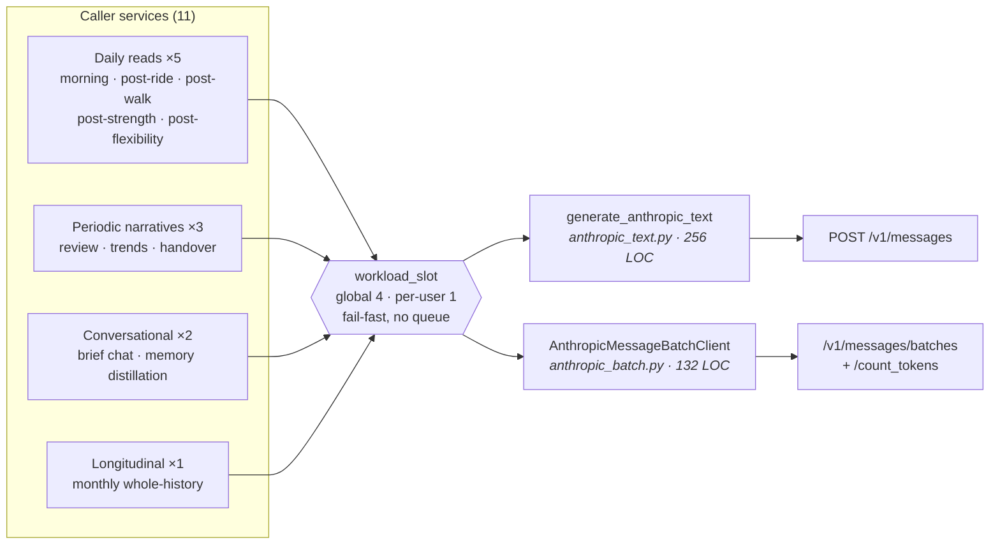
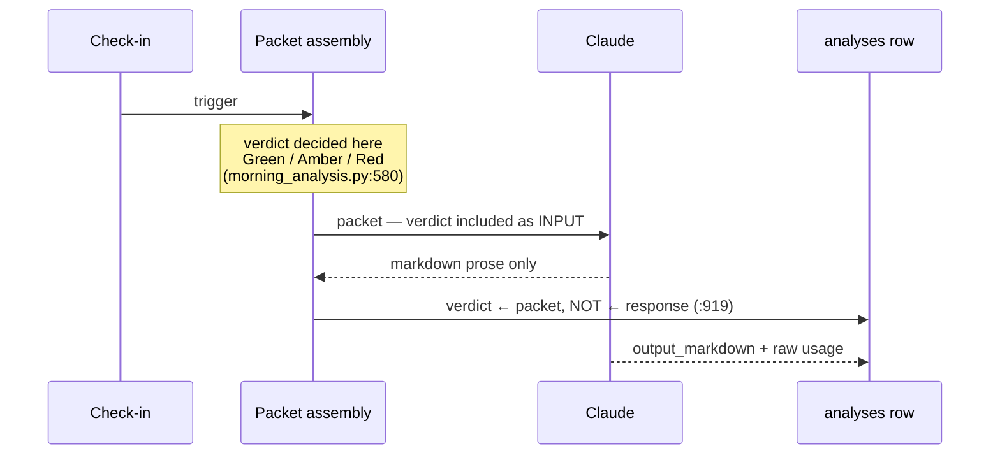
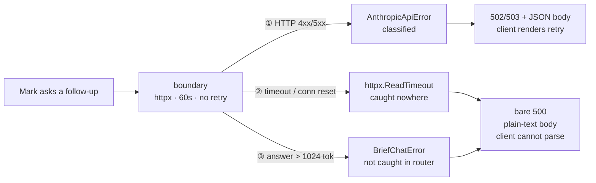

# Claude API boundary — architecture review

> Read-only review, 2026-08-29, against `c4a1161`. No code changed.
> Rendered version with diagrams: <https://claude.ai/code/artifact/e30bf141-f02b-42c1-8cf1-ffa1f487dea0>
>
> Production was deliberately **not** queried — no live packet was measured and no health
> record was read. Token figures are character-count estimates (chars ÷ 4) of static
> prompt text and are labelled as such throughout.

## Summary

Better-than-average LLM integration. Every call funnels through two small modules, spend is
governed at three independent layers, and — the property that matters most — **the model
cannot change a safety decision**. Weaknesses are concentrated in failure handling: there are
**no retries anywhere**, and the error taxonomy built after the 2026-07-21 credit outage only
covers failures that arrive as an HTTP status.

## 1. The surface

Eleven logical call sites, two boundary modules, no stray HTTP calls to `api.anthropic.com`
anywhere else in the backend (verified by grep).

| Call site | Trigger | max_tokens | System prompt | Cached |
|---|---|---:|---:|---|
| Morning brief | Mark's check-in (11:00 backstop) | 4096 | ~3,950 tok | — |
| Post-ride | Garmin activity poll | 4096 | ~1,880 | — |
| Post-walk | Garmin activity poll | 4096 | ~320 | — |
| Post-strength | Garmin activity poll | 4096 | ~335 | — |
| Post-flexibility | Garmin activity poll | 4096 | ~410 | — |
| Weekly/monthly review | Sun 18:00 cron | 4096 | ~776 | — |
| Trends | On demand | 4096 | ~776 | — |
| Handover doc | On demand | 4096 | ~776 | — |
| **Brief chat** | In-request (user waiting) | **1024** | ~325 + packet | **yes** |
| Memory distillation | On demand | 1800 | ~366 | — |
| Longitudinal | Monthly · Batches API | 4096 | — | n/a |

`trends.py` and `handover.py` reuse `AnthropicReviewClient` with their own system prompts —
they are not separate boundaries.

## 2. The property that makes this safe

**The verdict is computed before the model is called, and persisted from the packet — never
parsed out of the response.**

`morning_analysis.py:919` reads `context_packet["verdict"]["status"]`; the model's output is
stored only as `output_markdown`. A hallucination, refusal, prompt injection, or model swap can
change the *wording* Mark reads — it cannot change whether today is a Red. The system prompt
reinforces this in language ("The model is not the judge") but the guarantee is **structural**.

**Protect this ordering through any refactor.**

## 3. Findings

| # | Severity | Finding | Location |
|---|---|---|---|
| F1 | **High** | No Anthropic call is ever retried | `anthropic_text.py:222-227` |
| F2 | **High** | Transport failures bypass the entire error taxonomy | `anthropic_text.py:222`, `routers/brief_chat.py:137`, `scheduler.py:243` |
| F3 | Medium | Too-long chat answer is a hard error, not a truncation | `anthropic_text.py:233-235`, `brief_chat.py:175` |
| F4 | Medium | Three personal fields sent to Anthropic with no consumer | `morning_analysis.py:1265-1269`, `post_workout_analysis.py:485-487` |
| F5 | Low | `context_packet` is a dead parameter on six clients | `morning_analysis.py:456` +5 |
| F6 | Low | Chat discards usage — highest-volume call unaccounted | `brief_chat.py:204-208` |
| F7 | Low | Fresh TLS connection per call | `anthropic_text.py:222`, `anthropic_batch.py:57,76,86,95` |
| F8 | Low | Two over-broad substring rules in error classification | `anthropic_text.py:76-95` |
| F9 | Low | Concurrency gate is in-process only | `workload_budget.py:24-26` |

### F1 — No retries (High)

A single `client.post(...)`: no backoff, no attempt loop, no `max_retries`. The code classifies
529/429 into a set named `_RETRYABLE_ANTHROPIC_REASONS`, but that set only decides which
sentence to show the user. **Nothing retries.** The official SDK retries 408/409/429/5xx twice
by default; the hand-rolled boundary gave that up when it chose raw HTTP.

*Failure:* one 529 at 06:40 kills the morning brief. Recovery is the 11:00 backstop — four
hours later — or Mark tapping Retry. Three attempts over ~30s would make the blip invisible.

### F2 — Transport failures bypass classification (High)

Classification hangs off `httpx.HTTPStatusError`, which only fires for a response that arrived.
`ReadTimeout` / `ConnectTimeout` / `ConnectError` are caught **nowhere in the repo** (grep for
`TimeoutException`, `ReadTimeout`, `ConnectError` returns no handler). Two consequences:

- **Chat path:** escapes to a bare `500` with a plain-text body — the exact regression the
  502/503 mapping (Batch 143) was written to fix. `main.py` registers only a rate-limit
  exception handler; there is no app-wide catch-all.
- **Longitudinal path:** `except AnthropicApiError` raises the operator alert, but the generic
  `except Exception` (`scheduler.py:243`) only logs — a timeout there fails **silently**.

### F3 — max_tokens is a hard error (Medium)

`stop_reason == "max_tokens"` raises. Chat is capped at **1024 tokens** (~750 words) and
`BriefChatError` is a bare `Exception` subclass the router does not catch. A thorough answer is
billed in full, thrown away, and surfaces as the same unparseable 500 as F2.

### F4 — Gratuitous PII (Medium)

Every packet carries `userId` (internal profile UUID), `latitude`, and `longitude` (Mark's home
coordinates). **No system prompt references any of the three**, and weather is already resolved
into `environment.weather`, so the model has no use for raw coordinates. Pure surface area: a
stable cross-request correlator plus a precise home location attached to sleep times and health
metrics, sent to a third party for zero coaching value.

`displayName` is different — the coach addresses Mark by name and the prompts name him
throughout. Keep it.

### F5–F9

See the rendered artifact for full failure scenarios. In brief: `context_packet` is accepted and
never read by six `generate()` methods (invites a future silently-empty prompt); chat drops
`raw_response` so the likely-largest spend line is the one you cannot reconstruct from SQL; a
new `httpx.AsyncClient` per call means no connection reuse; `"billing" in message` is checked
against the whole message so any error mentioning billing raises the credit alert, and
`"max_tokens" in message` conflates over-long input with an invalid argument; `workload_budget`
counters are module-level dicts that silently multiply by replica count if the API is ever
scaled past one container.

## 4. Prompt assembly and caching — no finding

Every request is a large static system prompt plus the packet serialised as the user turn with
`sort_keys=True` (deterministic → reproducible and cache-prefix-stable).

**Caching is applied in the one place it pays.** A once-daily call cannot hit a 5-minute cache
no matter how large its prefix, so the absence of `cache_control` on ten call sites is *correct,
not an oversight*. Chat — up to 20 turns minutes apart sharing a large prefix — is the case that
benefits, and `brief_chat.py:543-555` places the breakpoint correctly: stable content (system
prompt + the read + its packet) before it, volatile `app_state` after it.

Recording this explicitly because "only 1 of 11 call sites uses prompt caching" is a true
sentence that would have been a misleading finding.

*Structural note:* the cached prefix includes `analysis.context_packet`, which contains Mark's
own check-in text — user-authored content inside a system block. Risk is near-zero (one trusted
user reading his own data back), and the code already shows awareness of the category:
`_packet_without_stored_system_prompt` replaces stored prompt text with a SHA-256 fingerprint so
chat cannot re-ingest instructions as data. Worth closing only if a second, less-trusted profile
becomes real.

## 5. What's done well — protect these

- **Deterministic verdicts** — model narrates, never decides (`morning_analysis.py:919`).
- **One boundary, no leaks** — 11 call sites, 2 modules; model choice is a single setting.
- **Spend governed three ways** — SlowAPI over time, `workload_slot` over concurrency, 20-turn
  daily cap (`brief_chat.py:107`).
- **Self-healing generation claims** — advisory-locked and idempotent; a *failed* claim is
  reclaimable (`generation_requests.py:66-71`), so the 11:00 backstop genuinely retries.
- **Prompt-injection hygiene** — stored prompts fingerprinted, not echoed (`prompt_metadata.py`).
- **The batch path is exemplary** — pre-counts tokens, enforces `MAX_INPUT_TOKENS = 900_000`
  before spending, uses `output_config.format` json_schema, persists request metrics.

## 6. Two decisions worth revisiting

**Model + a closing pricing window.** The app runs `claude-sonnet-4-6`; the recorded decision was
to revisit cost ~Sept 2026, which is now. Claude Sonnet 5 is available at the *same list price*
($3/$15 per MTok) with introductory pricing of $2/$10 **through 2026-08-31**. Separately,
`thinking` and `output_config.effort` are set **nowhere** in this codebase — on a current model,
adaptive thinking at a tuned effort is the main quality lever, entirely unused.

Do not swap casually: these prompts are heavily tuned (the morning system prompt is ~3,950 tokens
of instruction about not softening deterministic verdicts) and need re-validating. But the swap
is one env var, and the deterministic-verdict architecture means a regression shows up as worse
prose, never as a wrong Red — an unusually safe place to experiment.

**Raw HTTP instead of the SDK.** A defensible, documented choice, and the boundary is well
written. But F1, F2 and F7 are all things the SDK does correctly out of the box, and all three
must be hand-built and hand-tested here. The boundary has 6 tests; **none exercise a timeout**.
Not a migration recommendation — just noting that "thin HTTP boundary" bought less than it
appears to.

## 7. If you fix three things

1. **Catch `httpx.TimeoutException` and `httpx.RequestError` in the boundary** and convert to
   `AnthropicApiError` with `reason="timeout"`. One change closes F2 in every caller at once and
   makes the existing 502/503 mapping and operator alerting cover what they were meant to.
2. **Add three attempts with exponential backoff** for the reasons the code already calls
   retryable — 429, 529, 5xx, plus the new timeout slug. Not 400s or auth. (F1)
3. **Delete `userId`, `latitude`, `longitude` from both packet builders.** Nothing reads them. (F4)

Then when convenient: raise the chat ceiling above 1024 and catch `BriefChatError` in the router
(F3); persist chat usage so the bill is fully attributable (F6).
